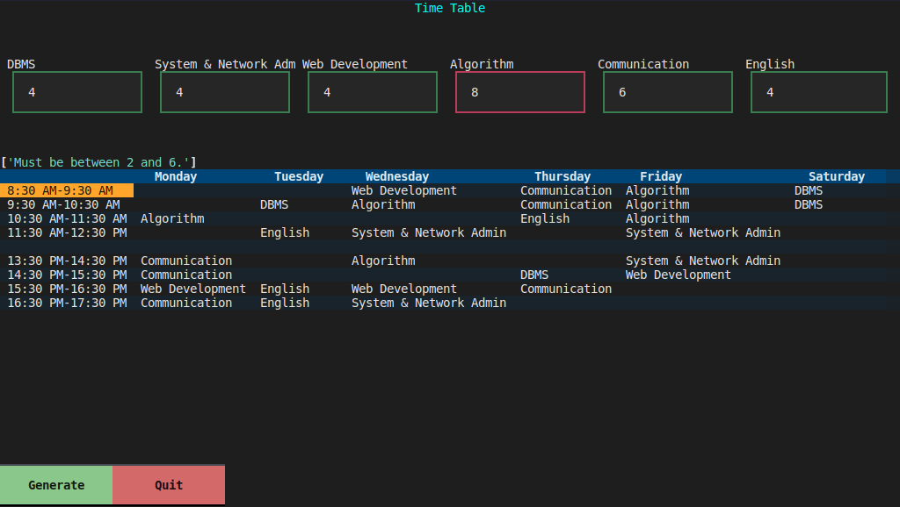

# Timetable 📊



## 📰 Description 
A CLI tool that allow you to generate a timetable for your school or university such that : 
 - A subject can't be seen on two consecutive days
 - A subject have a minimum of 2 hours per week and a maximum of 6
 - The timetable is divided in slots of 1 hours
 - The subjects are distributed between monday morning and saturady morning
 - Morning classes begin at 8:30 and end at 12:30
 - Afternoon classes begin at 13:30 and end at 17:30

 ## 📦 Installation 

 ### 🌐 Installation with [PIP](https://pypi.org/)
 You can install it using remote [PIP repository](https://pypi.org/project/wcc-timetable-generator/) as follows :
 ```bash
 pip install wcc-timetable-generator
 ```

 ### 💻 Installation from source

To install this project from source, you first have to clone this repo and install [poetry](https://python-poetry.org/) with pip : `pip install poetry`.
Then, go to the root directory and run the following commands : 
```bash
poetry install # install all the necessary dependencies
poetry build
poetry run python -m wcc_timetable_generator 
```

## 🖱 Usage
If you installed it with pip, this is how to run the project : 
```bash
wcc-timetable-generator
```
NB : In some case it may not run so you need to install it as administrator (using `sudo` on Linux or macOS or running the command prompt as administrator on Windows) or run as `python -m wcc_timetable_generator`.

If you installed it locally, this is how to run the project : 
```bash
poetry run python -m wcc_timetable_generator 
```
A GUI-like UI will appear, you can enter the number of hours per week for each subject that must be between 2  and 6 (otherwise it won't generate the timetable). Then, click on the `Generate` button to generate the timetable. If you want to quit, click on the `Quit` button. A random timetable based on the constraints will appear. 
You can click on the `Generate` button to generate another timetable.
You can also edit the number of hours before re-generating.

## ✅ Roadmap
- [x] Add the algorithm 
- [x] Add GUI-like UI
- [x] Publish to PyPI
- [ ] Add an animated GIF as demo to `README.md`
- [x] Write tests
- [x] Add quit button
- [x] Print error messages
